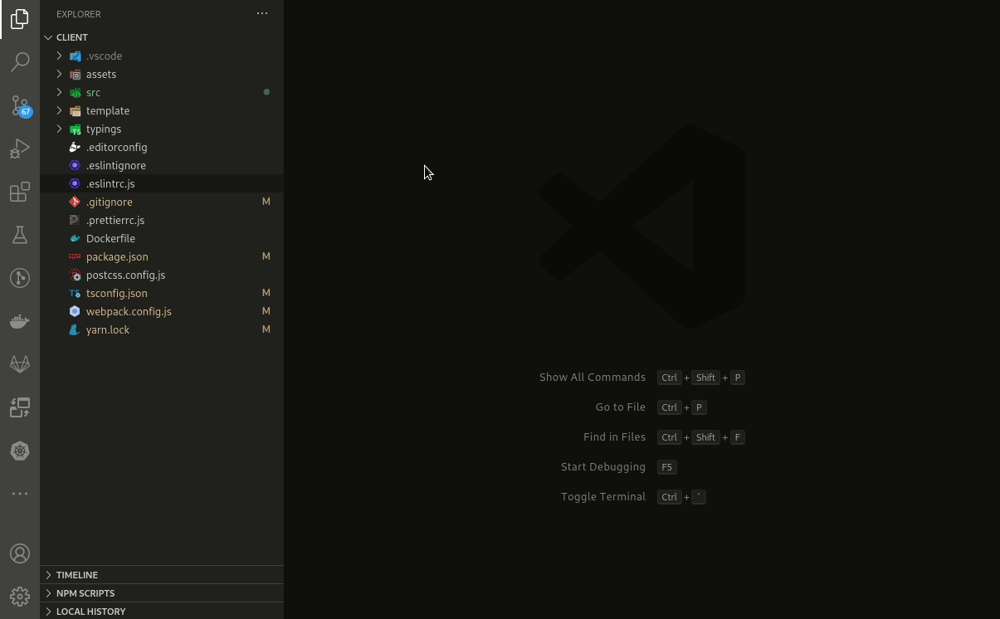

# Manage your tabs

**Everything you need to manage tabs.**

## Preview

When you install the Tabster extension in your activity bar will be available new icon. The extension main view frame is simple two-piece view for common and hot group tabs.

## Table of contents

- [Manage your tabs](#manage-your-tabs)
  - [Preview](#preview)
  - [Table of contents](#table-of-contents)
  - [Features](#features)
  - [Usage](#usage)
    - [Commands](#commands)
    - [GUI](#gui)
  - [Keyboard Shortcuts](#keyboard-shortcuts)
  - [Extension Settings](#extension-settings)
  - [Known Issues](#known-issues)
  - [Todo](#todo)
  - [Release Notes](#release-notes)
    - [[0.0.1] - 2020-11-10](#001---2020-11-10)
    - [[0.0.2] - 2020-11-12](#002---2020-11-12)
      - [Added](#added)
      - [Changed](#changed)
      - [Fixed](#fixed)

## Features

In general you can `save` and `load` groups of tabs arranged by common and hot category.

## Usage

### Commands

First open command palette (by pressing <kbd>Ctrl</kbd>/<kbd>Cmd</kbd> + <kbd>Shift</kbd> + <kbd>P</kbd>). Then enter command:

- `Save tabs` command. Will save tabs to common view.
- `Save tabs set [0-9]` commands set. Will save tabs to hot view.
- `Activate tabs set [0-9]` command to load previously saved hot tabs group.

### GUI

Click at:

-  icon to load saved group of tabs.
- document title to load individual file.
-  icon to edit tabs group name.
-  icon in group title to clear all saved tab groups.
-  icon in list of saved files to remove individual document from group.
-  icon to refresh view if necessary.

## Keyboard Shortcuts

| Key                                                                                               | Command                     |
| ------------------------------------------------------------------------------------------------- | --------------------------- |
| <kbd>Ctrl</kbd> + <kbd>Alt</kbd> + <kbd>S</kbd> / <kbd>Cmd</kbd> + <kbd>Ctrl</kbd> + <kbd>S</kbd> | save tabs to `common` group |
| <kbd>Ctrl</kbd> + <kbd>Alt</kbd> + <kbd>0</kbd> / <kbd>Cmd</kbd> + <kbd>Ctrl</kbd> + <kbd>0</kbd> | save tabs to `hot` group 0  |
| ...                                                                                               |
| <kbd>Ctrl</kbd> + <kbd>Alt</kbd> + <kbd>0</kbd> / <kbd>Cmd</kbd> + <kbd>Ctrl</kbd> + <kbd>9</kbd> | save tabs to `hot` group 9  |
| <kbd>Alt</kbd> + <kbd>0</kbd> / <kbd>Cmd</kbd> + <kbd>0</kbd>                                     | activate `hot` group 0      |
| ...                                                                                               |
| <kbd>Alt</kbd> + <kbd>0</kbd> / <kbd>Cmd</kbd> + <kbd>9</kbd>                                     | activate `hot` group 9      |

## Extension Settings

| Name                       | Default   | Values           | Description                                                                                                                 |
| -------------------------- | --------- | ---------------- | --------------------------------------------------------------------------------------------------------------------------- |
| `tabster.activateBehavior` | `replace` | `replace|append` | On tabs activating all previous tabs will be closed. `append` - tabs will be appended to exist ones.                        |
| `tabster.saveTabsOrder`    | `true`    | `true|false`     | Save tabs order on load (slow). You can turn off this option to speed up tabs activation process with excuse of tabs order. |

## Known Issues

- Not all tabs can be saved (some media files).
- Saving/activating tab groups takes long time to go.

> At all there is no explicit api in vscode to work with editors. Look for this topic for more details ([issue](https://github.com/microsoft/vscode/issues/15178))

## Todo

- Open diff files properly
- Save/load tabs quickly
- Open documents from source control arbitrary revisions
- Add DnD functionality to tab group list

## Release Notes

### [0.0.1] - 2020-11-10

Initial release

### [0.0.2] - 2020-11-12

#### Added

- Consider editor column
- Ability to open arbitrary document from any group

#### Changed

- Extension icon
- Updated preview
- Exchange default common and hot groups view position
- Document label in tab group list
- Readme file is more fine look
- Save behavior to common tabs group (able to edit group with same label)

#### Fixed

- Prevent commands race condition
- Execution bug when no item is sent to command handler
